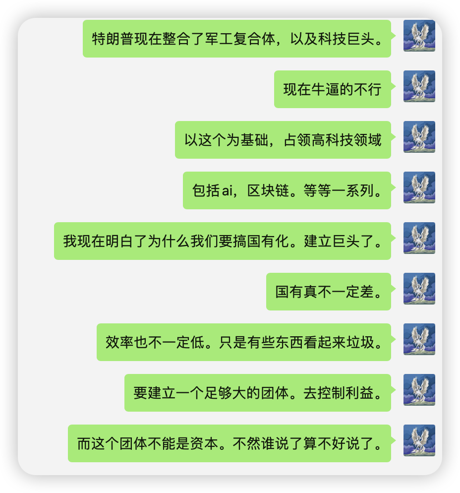
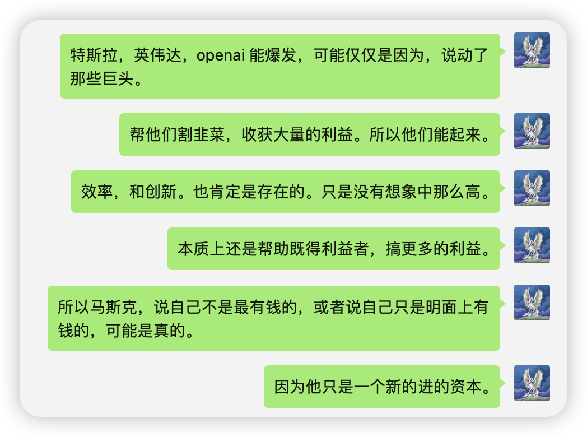

# 1, 世界是利益决定的，无分好坏，正义，邪恶

# 2， 军事霸权--共和党

建立设想敌对国家，挑起地方战争敌对，售卖武器

乌克兰和俄罗斯战争 -> 大规模售卖武器 -> 乌克兰大规模出售自己的资产 -> 美国军工资本获利 -> 美国军工资本无法获得利益 -> 和谈 -> 俄乌战争结束

中国台湾 -> 挑动台湾独立 -> 中台关系紧张 -> 台湾，大规模购买武器 -> 美国军工资本获利

结束美国的敌对的方式:
- 屠龙勇士，成为新的恶龙，建立的世界霸权
- 认输，将最好的肉给美国，放弃一切高科技，让美国任意收割，给予给求。日本和韩国

# 3， 美元霸权--金融霸权 -- 民主党

美联储加息，世界各国美元回流美国，因为利息高，资本是逐利的。 -> 美元升值，各种实体资产就贬值，比如房子，股票 -> 美国在此时利用更高价值的美金，开始收购各国的核心资产，重要资产。实现手段包括武力威胁。这一步完成以后,国际将会变得乌七八糟，但是自己国内的环境将是全世界最好的。 -> 美联储降息，美元贬值 -> 美国将手里的实体资产，将迅速升值。当升值差不多了，用最高价卖给这个国家，从而获得更多的美金，而更多的美金是需要该国用更多的自己的资源去换取的。从而这个国家会变的更贫穷。日本，欧洲，阿根廷，都是显著的例子。完成这个过程美国手里积累了大量的美金。就可以进行下一个循环了，加息。

# 4， 挣钱的最快方式 -- 帮助既得利益者，获得更大的利益
- 通过金融
- 通过科技创新和发明，改善效率
- 通过中介

# 5, 不管是中国，还是美国，还是什么国家。
所有存在的形式，都是利益演化的结果。只有获得足够的既得利益者，才能长久活下去。其他人都是凑数的。

人民要干事，要不会造反 -> 上层控制好给的利益 -> 既能活下去，又不至于太过分。人矿

等有机器人后，这些人也许可能不再重要。像隋炀帝出现的状况，就可能不会出现了。

# 6， 国有化

