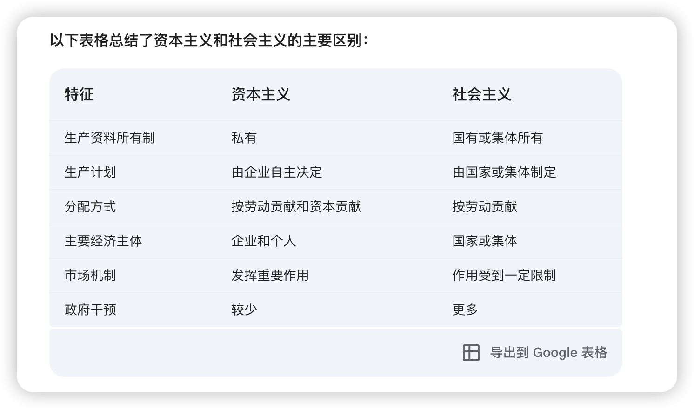

# 1，美国-资本主义
资本主义：
    - 存在阶级
    - 谁的钱多，这个国家谁说了算
    - 私有制
    - 利润最大化
    - 市场机制
    - 自由竞争

# 2. 中国-共产主义
共产主义：
    - 主张消除阶级，人人平等
    - 主张平均分配所有社会资源
    - 公有制
    - 不追求利润最大化
    - 计划经济

# 3. 中国-美国政体
我认为并无本质不同，本质都是上层对下层的收割。

中国 - 只允许固定的人进行收割。和底层人毫无关系。

美国 - 允许底层人选择一个人来进行收割。反正都会被割。选一个割的轻一点的。

# 4. 我认为
