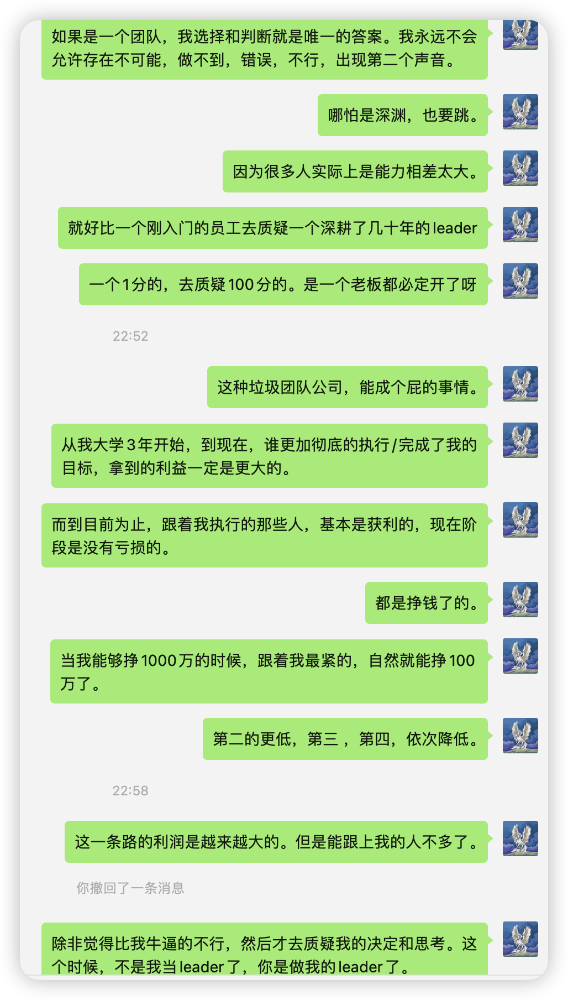
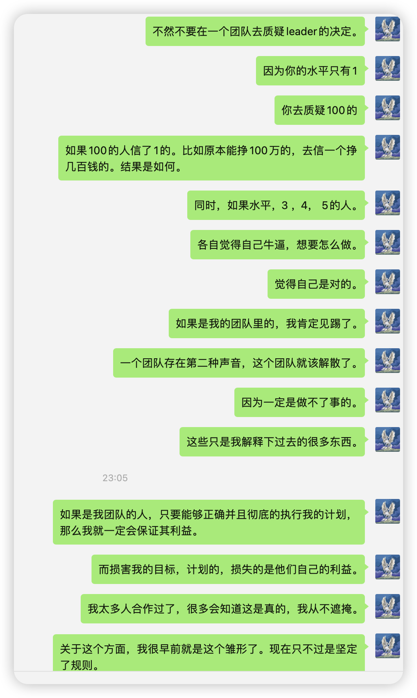

# 1， 公平 
- 所有人在合格，公平的基础最基础的几条规则下，去竞争。

# 2， 严格
- 不支持任何拖延
- 不允许任何怀疑
- 不允许任何做不到

# 3， 重利
- 有钱可以使鬼推磨，重赏之下必有勇夫。

# 4， 目标
- 目标是唯一的
- 目标是具体的
- 目标是所有人前进的方向

# 5,  严谨
- 说了必做
- 说一不二

# 6， 要求最优秀的加入团队，不要垃圾的
- 垃圾的人带来垃圾的习惯和思想，完全会毒害一个团队，导致整体利益直接归零。
- 垃圾的人一堆问题，耽误所有的行动的进展。
- 垃圾的人学习能力极差，跟不上进程，导致无法实现最终目的。
- 垃圾的人思维懒惰，创新能力极差。

# 7，拥有超级伟大的理想，和目标。要给所有人带来巨大的利益，为所有人奋斗，而不是压榨，让别人挣钱。
- 我从未工作过，因为没有人值得我为他们工作
- 我值得别人跟随，我因为我足够强，优秀，拥有一切成功的必要因素
- 在物理世界中，我成功了太多次了

# 8, 我愿意给最好的期望，给除我之外的所有人，只要和我无关。

我不能给我自己最好的期望，因为我知道理想和现实鸿沟，巨大的投入，残酷的过程，我没有办法去规避。

# 9， 一个合格的leader，本质是引路人，让团队成员更强，走的更远，让团队更强，走的更远，最终顺利实现一个个伟大目标。而不是像奴隶一样去使用，造成麻木。

- 一个合格的leader，本质是引路人，让团队成员更强，走的更远，让团队更强，走的更远，最终顺利实现一个个伟大目标。而不是像奴隶一样去使用，造成成员的麻木。
- 如果时间是一种投资，有的leader，会让你的价值经过几天后，几年后，有10倍，100倍的增幅。
- 而有的会让你的价值，几天后，几年后直接爆仓归零。
- 我不会给任何人打工。没有人值得我去效力。
- 这个只是我给你们的建议。
- 如果你们足够熟悉，可以去比较下无人岛花香，以及国名辉，和其他的差距，就知道了。
- 他们3年成长了很多，和太多的人相比而言。也掌握了很多其他的能力。这些都是超越普通人的优势。

# 10， 把成员分层
- 完全不可用
- 部分可用
- 可独立使用
- 潜力极大，不可大力培养使用
- 潜力极大，可大力培养使用

# 11， 现在可能看不懂，等你们可以成为leader，或者觉悟了，就会明白我说的很多东西了。太多的问题了。
- 有的还是可以当作机器人用的。
- 要分层，不然完全做不了事情。
- 不能让层次跃升。因为能力不够，迟早造成大祸
- 位置和能力一定要匹配。不是钱的问题
- 是对团队，目标，计划，能够造成多大损害的问题。
- 一个不小心，就会造成毁灭性打击。
- 以及大量的机会，全部流失的问题。造成无法发展。

# 12, 我想要做的事情
- 无冥冥之志者，无昭昭之明；无惛惛之事者，无赫赫之功。
- 夫英雄者，胸怀大志，腹有良谋，有包藏宇宙之机，吞吐天地之志者也。
- 永不放弃，绝不放弃。
- 古之立大事者，不惟有超世之才，亦必有坚忍不拔之志。
- 千回百转，千锤百炼，矢志不改