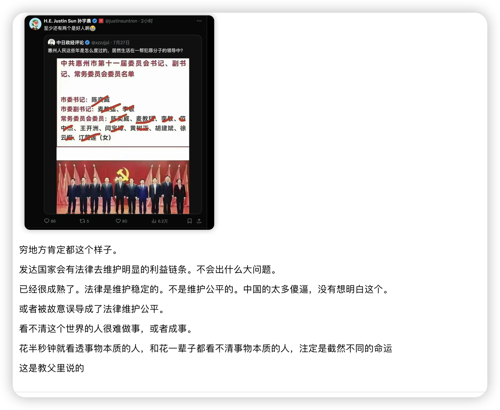

# 1，理大还是情大 ？

情大。中国倾向帮亲不帮理。国家之间，国民希望帮助情，本国。

# 2，经济自由度 ？

# 3, 情大还是利大 ？
利大。当损害自己的利益过大，就没有情了。这里有一个度，叫做经济自由度。

# 4，权大还是利大 ？
利大。 有权了就会贪污。

# 5，法大还是利大 ？
利大。违法了就会被抓。但是还是有人犯罪，这里有一个度的问题。

# 6， 法大还是理大 ？
理大。法律是维持稳定的，不是公平的。

利 》 权 》情 》 理 》法 

